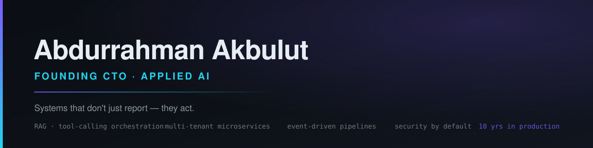

Hi, I'm Abdurrahman. I've been building software for 10 years and I currently lead the engineering of an AI-powered business process platform — a system that unifies customer discovery, purchase-intent scoring, omnichannel communication, CRM and operations tracking under a single AI layer. It doesn't only report; it triggers the follow-ups, alerts and automations itself.

I own the whole chain of decisions there: system architecture, the AI layer, infrastructure, security standards and the technology roadmap. Multi-tenant microservices, event-driven pipelines, RAG and tool-calling orchestration, and the evaluation harness that keeps the model honest.

Two things I don't negotiate. Security is day one, not a pass before launch. And I don't claim an improvement I can't measure — when I say multilingual AI response accuracy went from 85% to 100%, there's a harness behind that number.

Before this I spent most of a decade as a full-stack developer on e-commerce and CRM products. I wrote them, shipped them, and kept them alive afterwards. Most of my architectural instincts come from that last part.

Currently going deeper on the model side: fine-tuning, domain adaptation and evaluation methodology.

### Stack

### Projects

- **Torx AI** — AI-powered business process platform. Lead discovery, intent scoring, omnichannel inbox, CRM and operations in one system. *(private, in production)*

---

Open to collaboration on applied AI, distributed systems and process automation.

[LinkedIn](https://www.linkedin.com/in/abdurrahman-akbulut) · [torxsoft.com](https://torxsoft.com) · [info@torxsoftmedia.com.tr](mailto:info@torxsoftmedia.com.tr)
